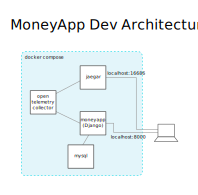

# MoneyApp


This is a semi serious app to try real world deployments of several technologies including Open Telemetry, HoneyComb, ECS and more.

## Quick start with Docker Dev Environment

Copy the default config files. There's no need to change anything just yet.

```bash
cp app/.env.example app/.env
cp otel-collector-config.yaml.example otel-collector-config.yaml
```

Run the application. If its your first time running the app it will take a couple of minutes while containers get downloaded and built

```bash
docker compose up
```

You should be able to access the following services in your browser.

|||
|---|---|
|App|http://localhost:8000/|
|Jaeger UI|http://localhost:16686/|

 * The app container will reload on code changes.

 * This project used structured logging which can be seen in the console and is also exposed in a shiny web ui.

### More helpful operations

Rebuild app container manually

```bash
docker compose build app
```

## Contributing

All contributions should be formatted with black and flake8. This will be checked and enforced with CI/CD checks on pull requests.

 * [Black - The uncompromising code formatter.](https://pypi.org/project/black/)
 * [Flake8 - the modular source code checker](https://pypi.org/project/flake8/)

Its recommended to install both of on your local workstation and either run them manually before pushing or
have your IDE/editor run them automatically.

```bash
pip install -r requirements-dev.txt
```

## Architecture

### Dev (docker compose)


